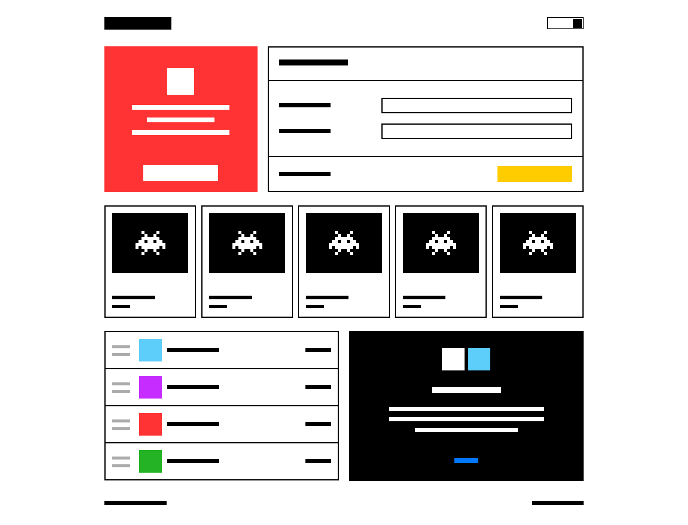

# Задание 1. Реализуйте дизайн-систему

В этом репозитории находятся материалы тестового задания «Реализуйте дизайн-систему» для [16-й Школы разработки интерфейсов](https://yandex.ru/promo/academy/shri) (зима 2020, Москва).

## Задание

Дизайн-система — это правила построения интерфейса. Благодаря им интерфейс будет консистентным и органичным. Вам нужно реализовать блоки дизайн-системы.

Дизайн-система, описанная в этом задании, предназначена для конструирования прототипов, в которых элементы интерфейса обозначены схематически, а вместо реальных данных — заглушки.

Правила дизайн-системы описаны в терминах методологии [БЭМ](https://ru.bem.info/methodology/key-concepts). Для обозначения сущностей интерфейса используется [соглашение по именованию](https://ru.bem.info/methodology/naming-convention).

### Что нужно сделать:

1. Реализовать [базовые блоки](BASE.md) дизайн-системы.
2. Реализовать [контентные блоки](CONTENT.md).
3. [Cобрать](PAGES.md) несколько страниц из разных блоков.

### Как проверить

В каталоге `pages` находятся скриншоты страниц и их шаблоны в синтаксисе BEMJSON. Файл `templater.js` содержит функцию-шаблонизатор, которая преобразует шаблоны в HTML-разметку на стороне клиента. С помощью нее можно проверить правильность выполнения задания.

### Результат

В качестве результата выполнения задания предоставьте исходный код и собранные бандлы с реализацией дизайн-системы.

В корне репозитория должен находиться каталог `build` с файлами `style.css`, `script.js`. Размер каждого файла — не более 1 МБ. `style.css` — стили для всех блоков и модификаторов. `script.js` — код, который обеспечивает интерактивность блоков. Он будет запускаться один раз после загрузки страницы. События на блоках должны делегироваться в один обработчик на теге `<body>`